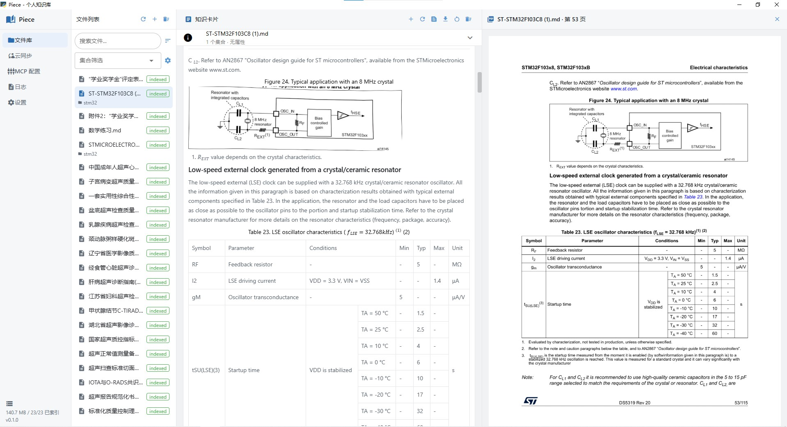
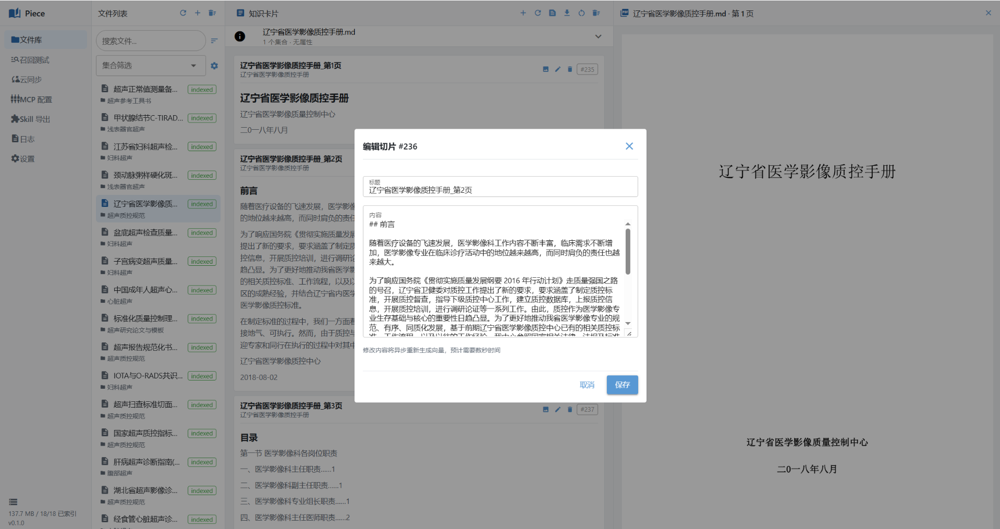
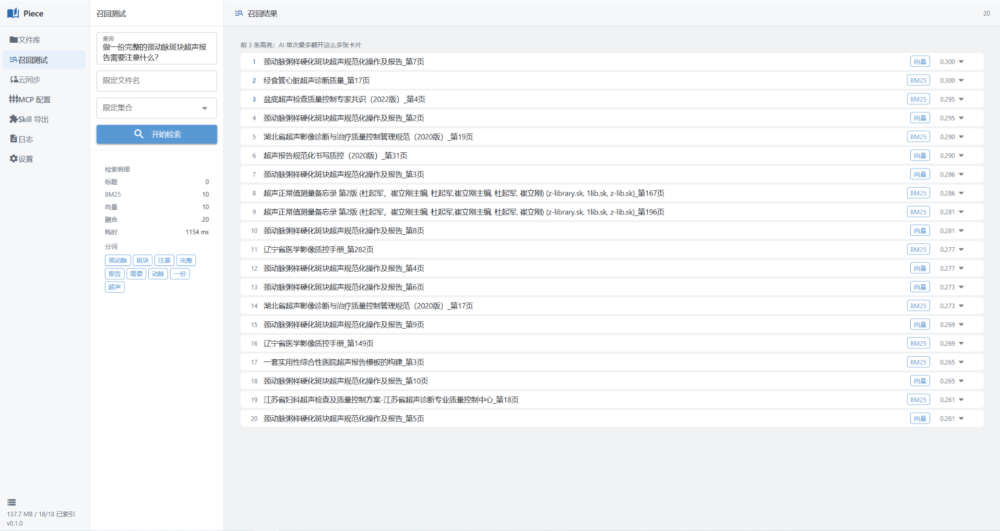
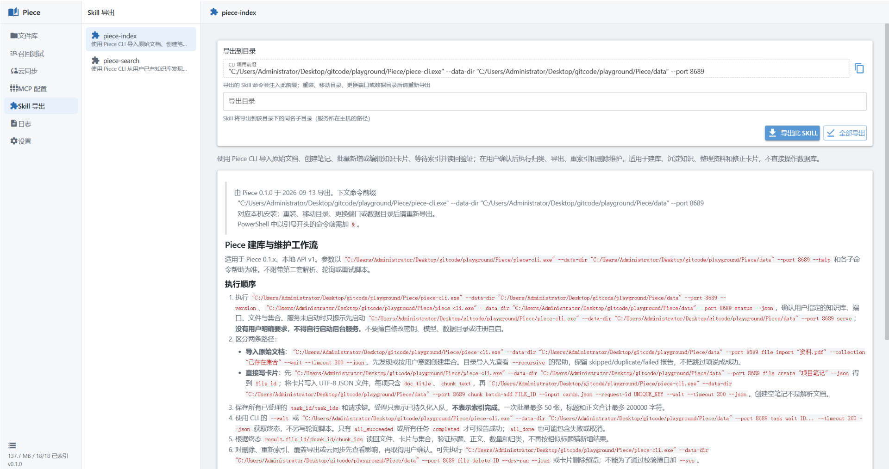
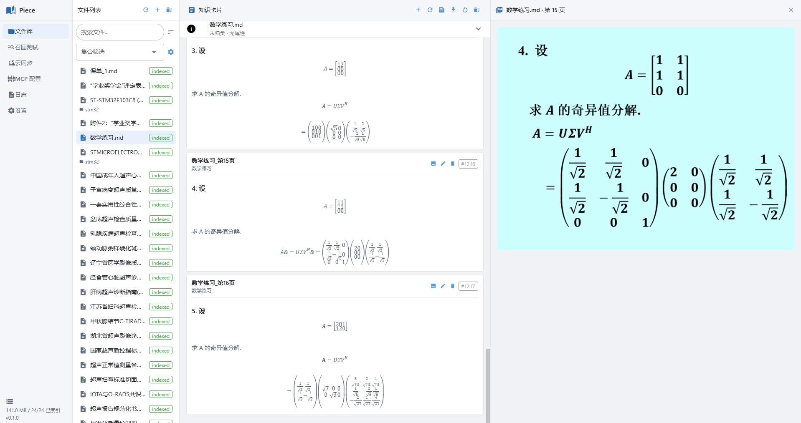
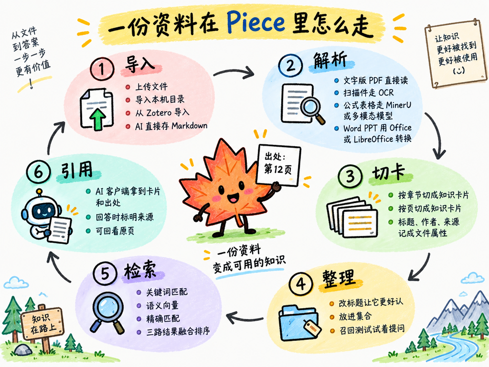
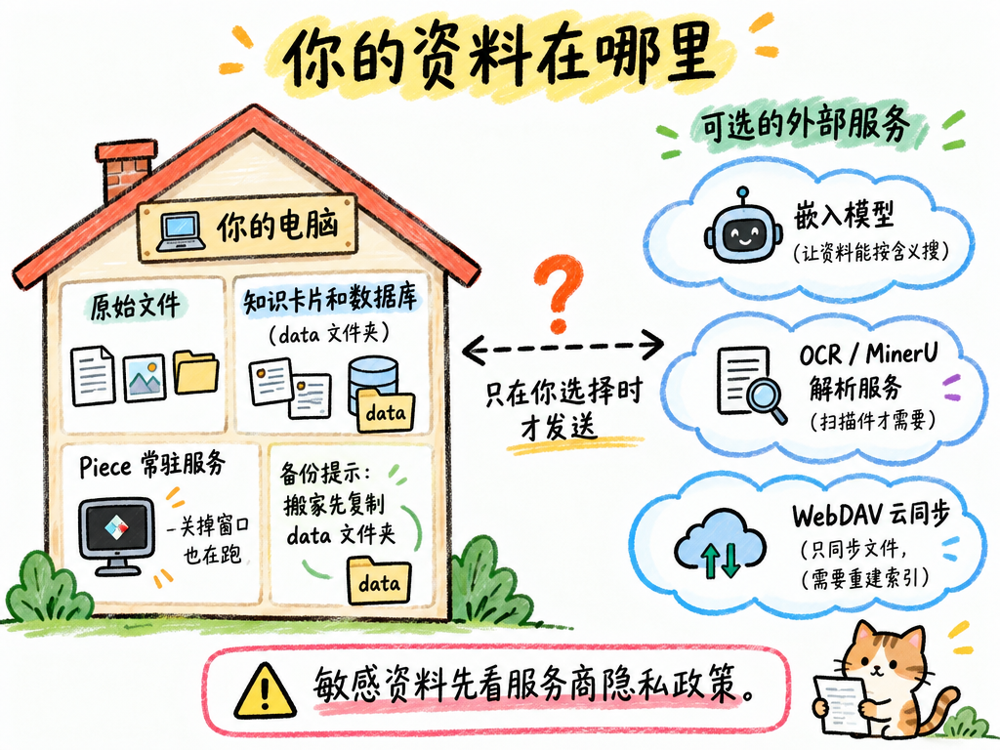

<div align="center">


[简体中文](README.md) | **English**

</div>

<a href="assets/一图看懂%20Piece.png"></a>

## What Piece can do

- **Find information**: Let AI find relevant passages and cite sources instead of searching through files by hand.
- **Edit knowledge cards**: Your documents are organized into knowledge cards with editable titles and text.
- **Check the originals**: Compare cards with PDF pages or pages converted from Word and PowerPoint to spot parsing errors.
- **Organize notes**: Group files into collections, and let AI help you create notes and add cards.

Before and after Piece, the same tasks look like this:

<a href="assets/为什么选%20Piece.png"></a>

## Screenshots

The screenshots show the Chinese interface. Click any image to view it at full size.

<table>
  <tr>
    <td width="50%" align="center" valign="top">
      <a href="assets/原页对比图.jpg"></a>
      <br><b>Source comparison</b> · Check content against the original
    </td>
    <td width="50%" align="center" valign="top">
      <a href="assets/知识卡片编辑.png"></a>
      <br><b>Card editing</b> · Correct content whenever needed
    </td>
  </tr>
  <tr>
    <td width="50%" align="center" valign="top">
      <a href="assets/召回测试.png"></a>
      <br><b>Recall Test</b> · Ask a question and see what comes back
    </td>
    <td width="50%" align="center" valign="top">
      <a href="assets/skill导出.png"></a>
      <br><b>Skill Export</b> · Let terminal-based AI use your knowledge base
    </td>
  </tr>
</table>

<details>
<summary>Another example: PowerPoint formulas and source pages</summary>

[](assets/ppt原页对比图.jpg)

</details>

## The life of a document in Piece

<a href="assets/资料的一生.png"></a>

## Getting started

### 1. Download and open Piece

Download the ZIP from [**Releases**](https://github.com/ultraplan-bit/Piece/releases), extract the entire archive, and double-click `Piece.exe`. The Windows package does not require a separate Python installation. Keep the executable with the other extracted files.

### 2. Set up the search model

Open **Settings → Embedding Model**. This model helps Piece search by meaning and needs to be configured before first use.

New users can start with the default [SiliconFlow](https://siliconflow.cn/) service:

1. Get your own **API Key** from the provider's dashboard.
2. Paste it into Piece. You can leave the default address and model unchanged.
3. Click **Test Connection**, then save once the test succeeds.

Other compatible services are also supported. External services may charge fees; check your provider's pricing and usage limits.

### 3. Import your documents

On the **Files** page, click **+ → Upload file** and pick the documents to import, then wait for processing to finish. Your knowledge cards will appear. Supported formats include **PDF, Word, PowerPoint, Excel (`.xlsx`), Markdown, TXT, HTML, and EPUB**.

- **Web pages and e-books**: Save a web page as HTML from your browser and import it. Piece keeps only the main content and records the title, author, and source URL as file properties; pages saved with a SingleFile-style extension keep their images too. EPUB e-books import directly, one card per chapter, with the book title and authors attached. DRM-protected e-books cannot be imported.
- **Scans, complex formulas, or tables**: Configure a PaddleOCR service, MinerU, or a custom multimodal model under **Settings → PDF Parsing Settings**. Follow the prompts to enter the service address and key, then test the connection. PDFs with a usable text layer can be imported without this setup.
- **Word / PowerPoint**: Installing Microsoft Office or LibreOffice is recommended. Formats such as `.doc`, `.ppt`, `.rtf`, `.odt`, and `.odp` require a working conversion tool.
- **Existing Obsidian notes or Zotero papers**: In the same menu, **Import local folder** brings in a whole Obsidian vault (skipping `.obsidian`, templates, and link-only index pages), and **Import from Zotero** imports every item that has a PDF together with its authors, year, DOI, and other properties. Zotero 7 or newer must be running with "Allow other applications on this computer to communicate with Zotero" enabled under Settings → Advanced. Both are one-time copies and never modify the source library.

After importing, open **Recall Test** and ask a relevant question to check whether Piece finds the content you need.

### 4. Connect your AI client

**Option 1: MCP Config**

MCP is a way for AI to access your knowledge base. Open Piece's **MCP Config** page, choose your AI client, copy the configuration, then save and reload it as required by that client.

- **Only need to search?** Choose the read-only retrieval service, `piece-kb`.
- **Want AI to write notes or edit cards too?** Also enable the indexing service, `piece-index`.

Do not share the access keys in your configuration. After changing keys or ports, fully quit and restart Piece, then update your AI client's configuration.

**Option 2: Skill Export**

If your AI can run local commands, you can also export and install workflows from **Skill Export**. Use `piece-search` to find information and `piece-index` to import and organize documents. Export them again after moving the application or changing the data directory.

Content your AI client fetches by itself, such as web pages, WeChat articles, or video transcripts, can go straight into the knowledge base: MCP uses the `import_markdown` tool of the indexing service, and the skill runs `piece file import` on a Markdown file. Piece keeps the original, splits it into cards automatically, and records the title and source URL as file properties.

Once connected, ask a question in your **AI client**, for example:

> Find the relevant explanations in my documents and cite the sources.

Piece provides the source material; conversations and answers still take place in your usual AI client.

## A few useful tips

- **Search results not quite right?** Check the card text first, then make the title more specific. For example, “Authentication: Token refresh flow” is easier to recognize than “Chapter 3.”
- **Too many documents?** Organize them into collections such as “Research,” “Work,” and “Study” to narrow your search.
- **Want to take your content elsewhere?** Markdown exports preserve card edits. Exporting with resources also bundles the illustrations.
- **Need to parse a document again?** You can reindex it, but **reindexing from the original file overwrites manual edits**. Export or back up your work first.

## FAQ

<a href="assets/安心用.png"></a>

**Are my files uploaded?**

Files and the database are stored locally. However, cloud models and parsing services receive the relevant text, queries, or page content, and your AI client also receives the material you retrieve. Check the privacy policies of your chosen services before processing sensitive information.

**Can AI still search after I close the window?**

Yes. Closing the management window does not stop the background service. To fully quit Piece, use the exit option in the system tray menu.

**Where is my data, and how do I back it up?**

The Windows portable package stores data in the `data/` folder beside the application by default. Fully quit Piece before backing up that folder or upgrading. If you changed the storage location, back up that data directory too.

**Can I sync between computers?**

Use **Cloud Sync** to connect a WebDAV-compatible service such as Nutstore. It syncs files, not the complete knowledge base; other devices need to build their own indexes. **After the initial sync, the local files take precedence, which can overwrite or delete remote files. Back up first.**

**What if an import fails or AI cannot find my documents?**

Check the model connection, file processing status, and AI client configuration. Scanned documents also need a parsing service. See **Logs** for specific errors.

<details>
<summary>Run from source and use the command line (optional)</summary>

Python 3.12+ is required. We recommend [uv](https://docs.astral.sh/uv/getting-started/installation/) to manage the environment:

```bash
git clone https://github.com/ultraplan-bit/Piece.git
cd Piece
uv sync --python 3.12 --locked --extra desktop
uv run --extra desktop piece serve --open
```

On macOS and Linux, you can run from source with a browser-based interface; real-device compatibility is still being improved. For command-line help, run `uv run --extra desktop piece --help`. With the Windows portable package, use `piece-cli.exe` in your terminal. Commands that work with your knowledge base require the Piece service to be running.

</details>

---

Found a problem or have a suggestion? [Open an issue](https://github.com/ultraplan-bit/Piece/issues) with reproduction steps and redacted screenshots. Do not upload access keys or private documents.

## Community

This project recognizes and links to the [LINUX DO](https://linux.do) community.

## License

This project is open source under the [MIT License](LICENSE).
