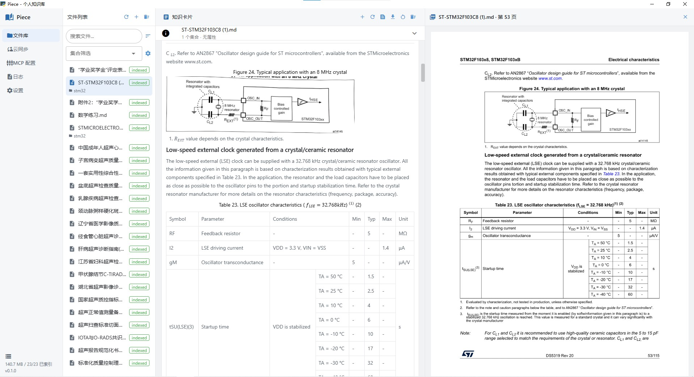
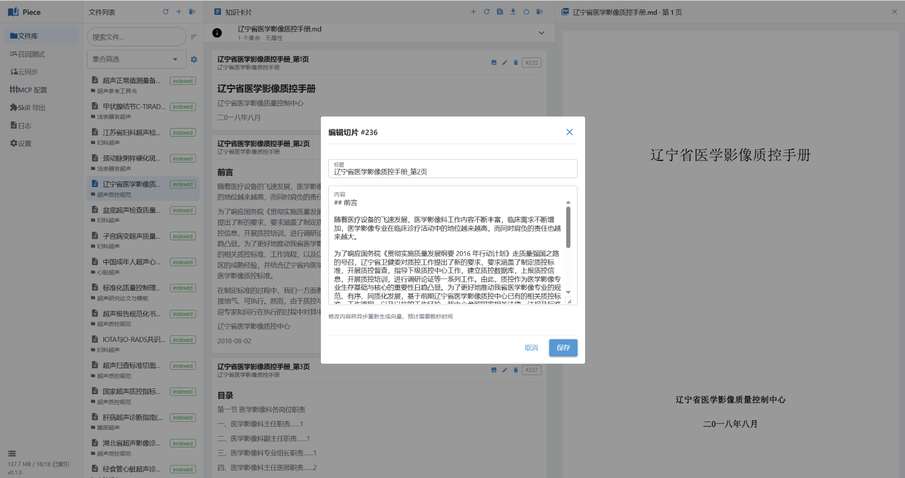
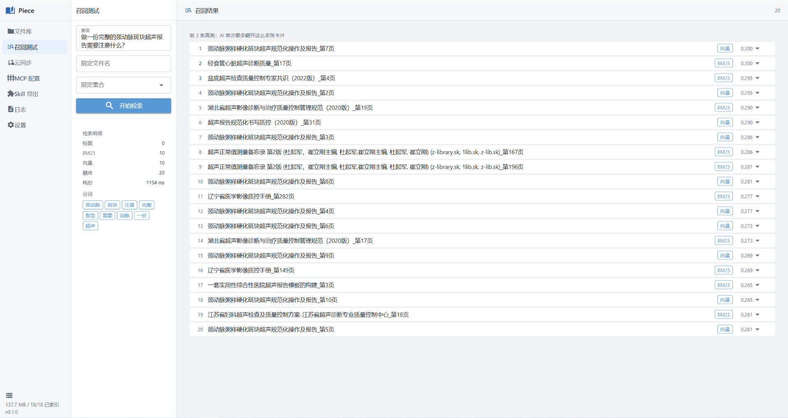
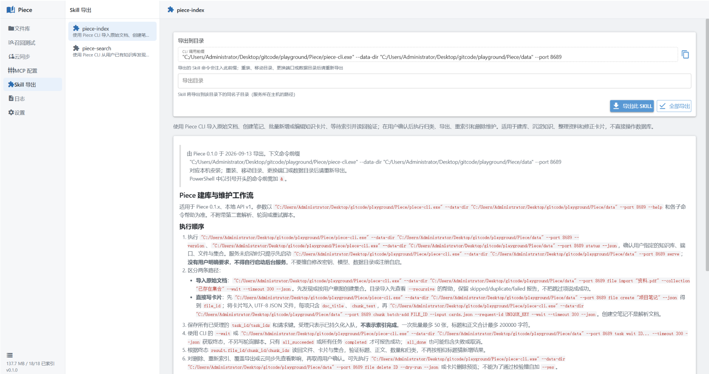
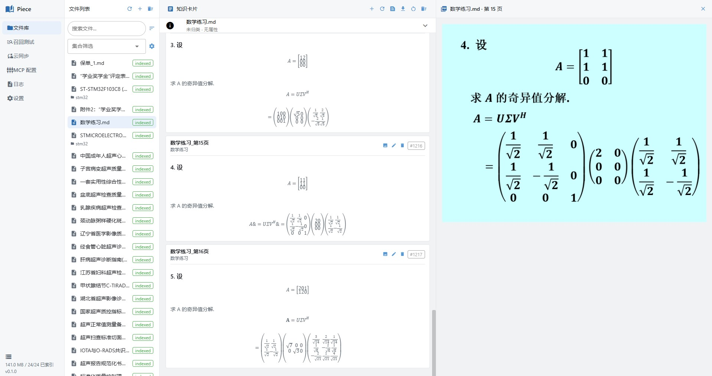
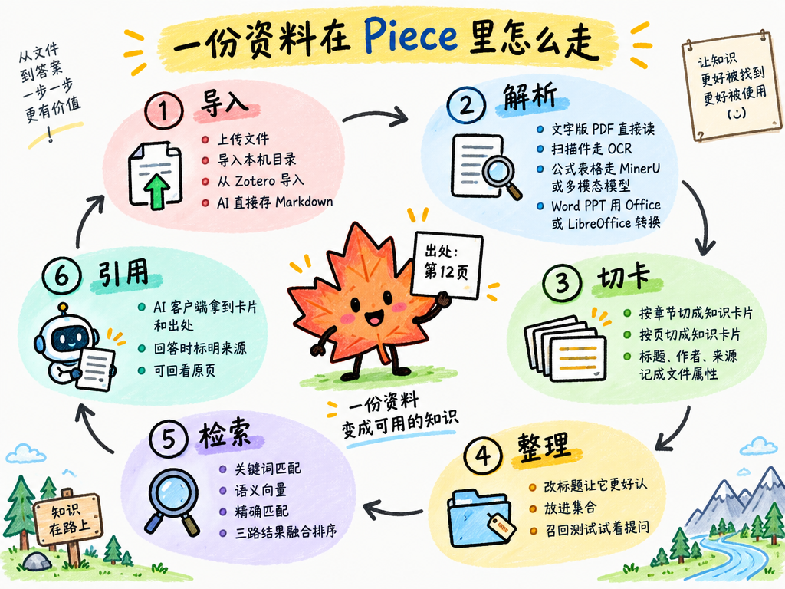
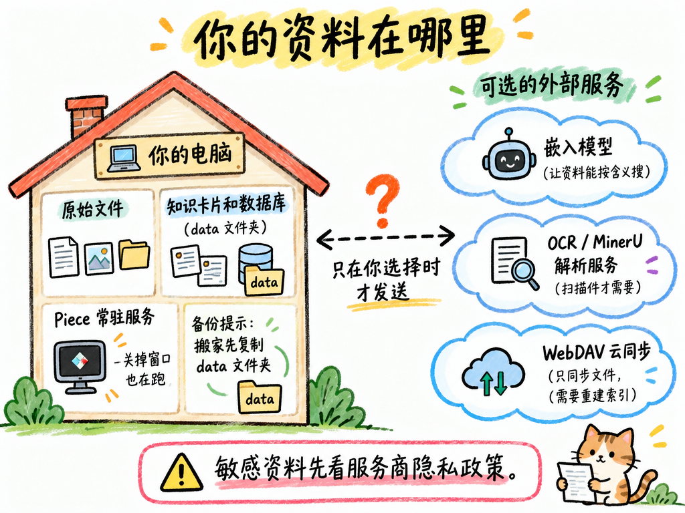

<div align="center">


**简体中文** | [English](README.en.md)

</div>

<a href="assets/一图看懂%20Piece.png"></a>

## 能帮你做什么

- **查资料**：不用反复翻文件，让 AI 帮你寻找相关内容并标明出处。
- **改卡片**：资料会整理成一张张知识卡片，标题和正文都能自己修改。
- **看原文**：对照 PDF 或转换后的 Word、PPT 原页，检查有没有解析错误。
- **整理笔记**：用集合给资料分类，也可以让 AI 帮你新建笔记、补充卡片。

同样的几件事，换成 Piece 前后是这样：

<a href="assets/为什么选%20Piece.png"></a>

## 界面预览

点击图片可查看大图。

<table>
  <tr>
    <td width="50%" align="center" valign="top">
      <a href="assets/原页对比图.jpg"></a>
      <br><b>原页对比</b> · 对照原文，放心核对
    </td>
    <td width="50%" align="center" valign="top">
      <a href="assets/知识卡片编辑.png"></a>
      <br><b>卡片编辑</b> · 内容不准，随手修正
    </td>
  </tr>
  <tr>
    <td width="50%" align="center" valign="top">
      <a href="assets/召回测试.png"></a>
      <br><b>召回测试</b> · 试着提问，看看能找到什么
    </td>
    <td width="50%" align="center" valign="top">
      <a href="assets/skill导出.png"></a>
      <br><b>Skill 导出</b> · 让终端 AI 也能使用知识库
    </td>
  </tr>
</table>

<details>
<summary>再看一个例子：PPT 公式与原页对比</summary>

[](assets/ppt原页对比图.jpg)

</details>

## 一份资料在 Piece 里怎么走

<a href="assets/资料的一生.png"></a>

## 快速上手

### 1. 下载并打开

前往 [**Releases 下载**](https://github.com/ultraplan-bit/Piece/releases)，完整解压 ZIP，双击 `Piece.exe` 即可。Windows 版不需要额外安装 Python，也不要只把 exe 单独移出来。

### 2. 配置搜索用的模型

打开 **设置 → 嵌入模型**。它负责让资料能够按含义搜索，第一次使用需要配置。

新手可以使用默认的[硅基流动](https://siliconflow.cn/)服务：

1. 在服务商控制台获取自己的 **API Key**。
2. 粘贴到 Piece 中，默认地址和模型先不用改。
3. 点击「测试连接」，成功后保存。

也支持其他兼容服务。外部服务可能收费，额度和价格以服务商为准。

### 3. 导入资料

在「文件库」页面点击 **+ → 上传文件**，选择要导入的文件，等待处理完成，就能看到知识卡片。支持 **PDF、Word、PPT、Excel（`.xlsx`）、Markdown、TXT、HTML 和 EPUB**。

- **网页和电子书**：网页在浏览器里「另存为」HTML 后导入，Piece 会只取正文区，并把标题、作者、来源地址记为文件属性；用 SingleFile 一类扩展保存的单文件网页还能保留图片。EPUB 电子书直接导入，按章节成卡，书名、作者等信息一并带入；带 DRM 的电子书无法导入。
- **扫描件、复杂公式或表格**：在「设置 → PDF 解析」中配置 PaddleOCR 服务、MinerU 或自定义多模态模型，按页面提示填写地址、密钥并测试连接。普通文字版 PDF 可以先直接导入。
- **Word / PPT**：建议安装 Microsoft Office 或 LibreOffice；`.doc`、`.ppt`、`.rtf`、`.odt`、`.odp` 等格式必须有可用的转换工具。
- **已有的 Obsidian 笔记或 Zotero 文献**：同一菜单里的 **导入本机目录** 可整库导入 Obsidian vault（自动跳过 `.obsidian`、模板和纯链接的索引页）；**从 Zotero 导入** 会把带 PDF 的条目连同作者、年份、DOI 等属性一并导入，需要 Zotero 7 或更新版本正在运行，并在 Zotero 的「设置 → 高级」中勾选「允许本机其他应用程序与 Zotero 通信」。两者都是一次性复制，不会改动原库。

导入后可以打开「召回测试」，输入一个相关问题，看看能否找到想要的内容。

### 4. 接上你常用的 AI

**方式一：MCP 配置**

MCP 可以理解为 AI 访问知识库的连接方式。打开 Piece 的 **MCP 配置** 页面，选择你使用的客户端，复制配置，按客户端要求保存并重新加载。

- **只想查资料**：选择检索服务 `piece-kb`。
- **还想让 AI 写笔记、改卡片**：再启用索引服务 `piece-index`。

不要分享配置里的访问密钥。修改密钥或端口后，需完全退出并重启 Piece，再更新客户端配置。

**方式二：Skill 导出**

如果你的 AI 能运行本机命令行，也可以在 **Skill 导出** 页面导出并安装工作流：`piece-search` 用于查资料，`piece-index` 用于导入和整理资料，`piece-wiki` 用于编译和维护 Markdown 页面，`piece-graph` 用于维护图实体、语义关系和证据。移动程序或更换数据目录后，请重新导出。

**Wiki** 提供页面搜索、正文、引用、页面链接与历史；**知识图谱** 提供实体、关系表格、有界邻域和证据核查。分别使用 `piece wiki`、`piece graph` CLI，也可通过现有两个 MCP 服务读写。两边身份与生命周期独立，页面链接不是语义关系，同名不会自动关联，搜索不会跨功能合并。

Wiki 正文及元数据保存在配置 `data_path` 下的 `wiki/` Markdown 文件中；SQLite 只保留可重建的页面索引和独立审计。页面内链使用 `[标题](piece://wiki/页面UUID)`，改标题或文件名不改变身份。外部编辑后显式运行 `piece wiki rebuild-index` 刷新索引，不会重写 MD 或调用模型。

上传资料不会自动生成 Wiki 或图谱。删除来源文件会保留页面、图实体和各自引用快照，并把来源标记为缺失；“引用与当前来源一致”不代表事实已验证。

知识页的证据要求逐字引用原文，含公式、表格的长文本手抄极易出错。Agent 可用 `piece chunk extract` 从卡片正文按行号或匹配切出精确子串，直接得到可提交的证据（CLI、两个 MCP 服务均提供；MCP 中为索引服务的 `extract_quote` 与检索服务的 `extract-quote`）。

用 `--out` 可把切出的引文直接落成可提交的证据文件；匹配不唯一时先用 `--lines` 收窄，不猜第一条。

知识页的写入用意图命令，默认读回，并落一份本地请求文件：

```bash
piece chunk extract CHUNK_ID --lines 2-3 --out evidence.json
piece wiki page add --kind concept --title "增量维护" \
  --summary "只修改明确变化的内容" \
  --evidence-file evidence.json --request-file object-request.json
```

页面更新用 `wiki page update UUID --expected-revision N --expected-content-hash HASH`，哈希从最新读回取得，不能只改版本号绕过外部修改冲突。图实体用 `graph object add/update`，关系用 `graph relation add/update`；每次新操作使用新的请求文件，已有记录仅按各自 UUID 定位。

图谱批次在 SQLite 事务内提交；Wiki 批次按页面写入，可能部分成功。检查 `partial`、`errors` 和 `index_status`；文件已保存但索引失败时保留文件并显式重建索引，不重新生成或覆盖正文。

`--request-file` 保存本次操作的完整正文、证据和自动生成的请求键；文件已存在时只有目标与内容都相同才允许复用，绝不覆盖。`--dry-run` 只预检但同样写这份文件，确认后可原样正式提交：

```bash
piece wiki apply --input object-request.json --read-back
```

请求文件是本地敏感材料，删除在线记录不会删除它。写入返回的 `read_back` 最多含 20 条受影响记录；`READ_BACK_INCOMPLETE` 表示数据已提交但读回不完整或状态已变，不要重提。可恢复的错误附带 `next_command` / `next_argv`，用于在同一实例上继续只读核查；提交结果未知时先用 `wiki request --input object-request.json --read-back` 查询，无需手抄请求键。

AI 客户端自己取得的网页、公众号文章、视频字幕等内容也能直接存进知识库：MCP 用索引服务里的 `import_markdown` 工具，Skill 用 `piece file import-markdown` 从 stdin 或文件传入正文。Piece 会保留原件、自动切片，并把标题和来源地址记为文件属性。

连接完成后，在你的 **AI 客户端**中提问，例如：

> 帮我找出资料中关于这个问题的说明，并标明出处。

Piece 负责提供资料，聊天和回答仍在你常用的 AI 客户端中进行。

## 用顺手的几个小技巧

- **搜得不理想**：先检查卡片正文，再把标题改具体，例如「接口鉴权：Token 刷新流程」，比「第三章」更容易辨认。
- **资料太多**：用层级集合组织成「论文 → 检索增强」等范围；父集合默认包含子集合中的文件，也可关闭「包含子集合」只看直接归类。一份文件可归入多个集合，移动集合不移动原件。
- **想带走内容**：导出 Markdown 可保留卡片修改；带资源导出还会一起打包插图。
- **想重新解析**：可以重新索引，但**从原件重新索引会覆盖手工修改**，请先导出或备份。

## 常见问题

<a href="assets/安心用.png"></a>

**文件会被上传吗？**

文件和数据库保存在本地。但使用云端模型或解析服务时，文字、问题或页面内容会发送给对应服务；AI 客户端也会读取你取回的资料。处理敏感内容前，请确认所用服务的隐私政策。

**关掉窗口后，AI 还能查吗？**

可以，关闭管理窗口不会停止后台服务。要完全退出，请在系统托盘中选择「退出」。

**数据在哪里，怎么备份？**

Windows 解压版默认保存在程序旁的 `data/` 文件夹。升级或搬家前，先完全退出 Piece，再备份该文件夹；如果改过存储位置，也要备份对应的数据目录。必须同时备份 `wiki/` Markdown 文件与 SQLite 数据库（图谱、Wiki 审计历史及资料元数据），不能只复制数据库。删除 Wiki 页面会保留审计历史与 `.wiki-recovery-*.bak` 本地恢复副本；这些副本也应纳入备份。本地请求文件与外部备份不会随在线删除清除，在线删除不是彻底擦除。

**能在多台电脑间同步吗？**

可在「云同步」连接坚果云等支持 WebDAV 的服务。它只同步文件，不是完整知识库备份；其他设备需要重新建立索引。**后续同步以本地为准，可能覆盖或删除云端文件，请先备份。**

**导入失败或 AI 找不到资料怎么办？**

先检查模型连接、文件处理状态，以及 AI 客户端配置是否正确。扫描件还需要配置解析服务；具体错误可在「日志」中查看。

<details>
<summary>源码运行与命令行（可选）</summary>

项目要求 Python 3.12+，建议使用 [uv](https://docs.astral.sh/uv/getting-started/installation/) 管理环境：

```bash
git clone https://github.com/ultraplan-bit/Piece.git
cd Piece
uv sync --python 3.12 --locked --extra desktop
uv run --extra desktop piece serve --open
```

macOS / Linux 可通过源码运行，使用浏览器界面，实机兼容性仍在完善。命令行帮助可运行 `uv run --extra desktop piece --help`；Windows 便携版在终端中使用 `piece-cli.exe`。业务命令需要 Piece 服务已启动。

**仅用命令行管理知识库**（下面的 `piece` 在源码环境中换成 `uv run --no-sync piece`，便携版换成 `piece-cli.exe`）：

```bash
piece config init --interactive   # 在终端中配置嵌入模型，隐藏输入密钥，确认后才保存
piece start                       # 后台启动核心服务，确认就绪后返回
piece config test embedding       # 显式访问配置的模型服务，检查连接与维度
piece file import "资料.md" --wait
piece file list --name "资料"     # 文件名包含匹配，不是正文搜索或通配符
piece stats                       # 入库文件数、已索引文件数、切片数和原件大小总计
piece status
piece stop                        # 请求停止；服务会在退出前收尾在途工作
```

- `config init` 不带 `--interactive` 时仍是非交互初始化；脚本可接着用 `config update --offline --input 配置补丁.json`。向导不自动联网，不改已有管理/MCP 密钥；服务运行时拒绝离线保存，已有索引也不能直接切换嵌入模型、地址或维度。
- `start` 默认不启用 GUI、MCP 或托盘。需要时用 `start --gui --mcp`，或 `start --open --mcp` 启用并打开界面（需已有相应可选依赖）。`serve` 保留原有前台运行方式。
- 后台启动默认最多等待 60 秒，可用 `--timeout` 调整；日志位置会随结果返回，位于配置目录的 `logs/background-端口.log`。超时或 Ctrl+C 只停止等待，不强杀后台进程；请继续查看日志并用 `status` / `stop` 管理。重复 `start` 会复用相同目标的服务，不自动重启或更改其入口配置。
- 使用自定义知识库时，所有命令都保持相同的 `--data-dir` 和 `--port`；`--data-dir` 指配置目录，实际文件存储位置仍由配置的 `data_path` 决定。
- 文件已放入当前知识库的 `files/originals/` 时，可先 `piece file scan --dry-run` 预览，再 `piece file scan --wait` 登记并索引尚未入库的文件。扫描只检查该目录顶层的受支持原件，不覆盖已有文件或重新索引已登记文件；任意外部目录仍用 `file import --recursive`。部分扫描失败会保留已受理的任务 ID，并以失败退出码报告。
- `stats` 的大小是已登记文件的 `file_size` 总和，不是包含数据库、插图与日志的完整磁盘占用。

</details>

---

遇到问题或有建议，欢迎 [提交 Issue](https://github.com/ultraplan-bit/Piece/issues)。请附上复现步骤和脱敏截图，不要上传密钥或私人资料。

## 社区

本项目认可并链接 [LINUX DO](https://linux.do) 社区。

## 许可证

本项目基于 [MIT 许可证](LICENSE) 开源。
